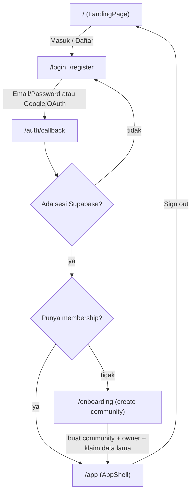
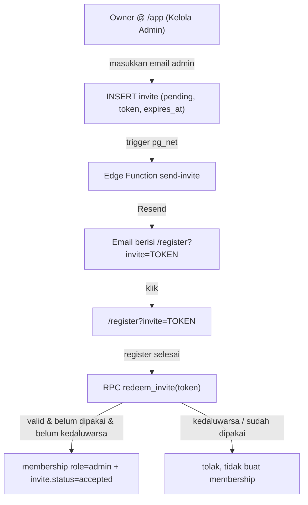

# Design Document — Fase 2: Auth + Multi-Tenant

## Overview

Fase 2 mengubah TangkasBoard dari aplikasi ber-gembok password client-side
(Opsi B) menjadi aplikasi multi-tenant dengan autentikasi Supabase yang
sebenarnya (Opsi C). Empat sub-sistem dikerjakan sebagai satu fondasi karena
saling bergantung:

1. **Auth** — Supabase Auth (Email/Password + Google), `persistSession: true`,
   guard route `/app` berbasis sesi, retire `PasswordGate`.
2. **Multi-tenant** — tabel `membership` (user ↔ community + role), onboarding
   create community (auto `owner`), community switcher, wiring `active_community`
   ke `Repo_Layer` menggantikan `DEFAULT_COMMUNITY_ID`.
3. **Invite admin** — tabel `invite`, pengiriman email via Resend, penukaran
   token saat register → membership `admin`.
4. **RLS ketat per-community** — mengganti policy permisif `anon using(true)`
   dengan predikat berbasis `auth.uid()` yang memeriksa keanggotaan di
   `membership`, termasuk tabel anak via join ke `session.community_id`.
5. **Migrasi data lama** — klaim satu kali & idempoten baris
   `community_id = DEFAULT_COMMUNITY_ID` ke community pertama milik user.

Keputusan kunci diambil dari steering `#phase-2-auth-multitenant` dan
`#go-public-roadmap`, serta fakta kode existing (`repo.ts` sudah menerima
`communityId` di tiap fungsi; `client.ts` `persistSession: false`; pola trigger
`net.http_post` di migration `011`; Edge Function Deno + Resend di
`notify-feedback`).

**Prinsip yang dipertahankan:** `Repo_Layer` tetap satu-satunya lapisan yang
bicara ke Supabase. Perubahan wiring community aktif dilakukan pada store/hook
yang memanggil `repo`, bukan menyebar `getSupabase()` ke UI.

**Batasan yang dibawa ke design (dari requirements):**

- Migrasi ditulis sebagai berkas SQL bernomor lanjutan (`012+`) di
  `supabase/migrations/`.
- UI "Database Webhooks" dashboard tidak tersedia → trigger DB memakai
  `net.http_post` (pg_net) mengikuti pola `011`.
- Pengiriman email `onboarding@resend.dev` hanya menjangkau email pemilik akun
  Resend; undangan ke email pihak lain butuh verifikasi domain dulu.
- `member` ada di enum role tetapi **tidak ada** alur pembuatan membership
  `member` di Fase 2 (jalur masuk non-invite, di luar scope).

---

## Architecture

### Alur autentikasi & routing (tingkat tinggi)



Alur invite (dibahas detail di bagian Invite):



### Lapisan & tanggung jawab

| Lapisan | Berkas (baru/ubah) | Tanggung jawab |
| --- | --- | --- |
| Route guard | `src/app/app/page.tsx` (ubah), `src/components/auth/route-guard.tsx` (baru) | Cek sesi Supabase; redirect ke `/login` bila tak ada sesi; redirect ke `/onboarding` bila tak ada membership |
| Halaman auth | `src/app/login/page.tsx`, `src/app/register/page.tsx`, `src/app/onboarding/page.tsx`, `src/app/auth/callback/route.ts` (baru) | UI login/register/onboarding + penanganan OAuth callback |
| Auth store | `src/lib/store/auth-store.ts` (baru) | Sumber tunggal state `session`, `user`, `memberships`, `activeCommunityId`; aksi `signIn/signUp/signInWithGoogle/signOut/loadMemberships/setActiveCommunity` |
| Repo (auth/tenant) | `src/lib/supabase/repo.ts` (tambah fungsi) | `listMyMemberships`, `createCommunityWithOwner`, `createInvite`, `redeemInvite`, `listCommunityMembers`, `updateMemberRole`, `kickMember`, `deleteCommunity` |
| Client | `src/lib/supabase/client.ts` (ubah) | `persistSession: true` |
| Retire gate | `src/components/password-gate.tsx`, `src/lib/auth/gate.ts` (hapus) | Dihapus; tidak lagi dipakai |
| Migrasi DB | `supabase/migrations/012_*.sql` … | Skema `membership`/`invite`, enum role/status, RLS baru, helper function, RPC, trigger invite, fungsi klaim data lama |
| Edge Function | `supabase/functions/send-invite/index.ts` (baru) | Kirim email undangan via Resend (pola `notify-feedback`) |
| i18n | `src/lib/i18n/dict.ts` (tambah) | Wording baru dwibahasa `{ id, en }` |

### Keputusan arsitektur & alasannya

- **Guard di client, bukan middleware SSR.** App sekarang murni client
  (`"use client"`, `zustand`, `getSupabase()` browser singleton). Menambah
  middleware SSR + cookie session akan merombak banyak. Guard client via
  `auth-store` + `persistSession: true` (localStorage) konsisten dengan
  arsitektur existing dan cukup karena RLS DB menjadi garis pertahanan
  sesungguhnya (bukan guard UI). *Referensi: Req 1.6, 1.7, 2.3.*
- **`active_community` disimpan di store + localStorage,** bukan di URL. `/app`
  adalah single-page shell (`AppShell`) tanpa routing per-community; menyimpan
  di store paling sederhana dan cocok dengan pola store existing. *Req 8.*
- **RLS memakai helper `SECURITY DEFINER` `is_member()`/`has_role()`** untuk
  menghindari rekursi RLS saat policy `membership` menanyakan `membership`.
  *Req 7.*
- **Email invite via trigger `pg_net` → Edge Function,** mengikuti pola `011`
  (UI Database Webhooks tidak tersedia). Alasan detail di bagian Invite.
- **Klaim data lama via RPC `SECURITY DEFINER`** yang dipanggil di dalam
  transaksi `createCommunityWithOwner`, dijaga idempoten oleh keberadaan baris
  `DEFAULT_COMMUNITY_ID`. *Req 10.*

---

## Components and Interfaces

### 1. Supabase client (`src/lib/supabase/client.ts`)

Perubahan minimal: `persistSession: true` agar sesi bertahan lintas reload dan
guard bisa membacanya. Tambah `autoRefreshToken: true` (default) dan
`detectSessionInUrl: true` untuk menangkap token OAuth di callback.

```ts
client = createClient(url, key, {
  auth: {
    persistSession: true,
    autoRefreshToken: true,
    detectSessionInUrl: true,
  },
  realtime: { params: { eventsPerSecond: 5 } },
});
```

*Validates: Req 1.6.*

### 2. Auth store (`src/lib/store/auth-store.ts`) — baru

Sumber tunggal untuk sesi & konteks tenant. Bentuk (ringkas):

```ts
interface Membership { communityId: string; communityName: string; role: "owner" | "admin" | "member"; }

interface AuthState {
  status: "loading" | "signedOut" | "needsOnboarding" | "ready";
  userId: string | null;
  memberships: Membership[];
  activeCommunityId: string | null;

  init(): Promise<void>;                 // baca sesi + onAuthStateChange + loadMemberships
  signInEmail(email: string, password: string): Promise<{ ok: boolean; error?: string }>;
  signUpEmail(email: string, password: string, inviteToken?: string): Promise<{ ok: boolean; error?: string }>;
  signInGoogle(inviteToken?: string): Promise<void>;   // redirect OAuth
  signOut(): Promise<void>;
  loadMemberships(): Promise<void>;      // set status ready/needsOnboarding
  setActiveCommunity(id: string): void;  // persist ke localStorage + trigger reload data
}
```

Logika status:
- Tidak ada sesi → `signedOut`.
- Ada sesi, `memberships.length === 0` → `needsOnboarding`.
- Ada sesi & minimal satu membership → `ready`, `activeCommunityId` =
  localStorage bila masih valid, jika tidak membership pertama. *Req 8.1, 8.5.*

`onAuthStateChange` dipakai agar sign-out/refresh token langsung memperbarui
guard. *Req 1.3, 1.5, 1.7.*

### 3. Route guard (`src/components/auth/route-guard.tsx`) — baru

Membungkus `/app`. Berdasarkan `auth-store.status`:
- `loading` → skeleton/null.
- `signedOut` → `router.replace("/login")`. *Req 1.7.*
- `needsOnboarding` → `router.replace("/onboarding")`. *Req 3.2.*
- `ready` → render `children` (`AppShell`). *Req 3.4.*

`src/app/app/page.tsx` berubah dari membungkus `PasswordGate` menjadi
`RouteGuard`:

```tsx
export default function AppPage() {
  return (
    <RouteGuard>
      <AppShell />
    </RouteGuard>
  );
}
```

*Validates: Req 2.1, 2.3.*

### 4. Halaman auth & onboarding

- `src/app/login/page.tsx` — form Email/Password + tombol "Masuk dengan
  Google". Sukses → `/app` (guard mengarahkan lebih lanjut bila perlu
  onboarding). Gagal → pesan error, tanpa sesi. *Req 1.1–1.4.*
- `src/app/register/page.tsx` — form register; membaca query `?invite=TOKEN`.
  Setelah register sukses, bila ada token → panggil `redeemInvite`. *Req 6.4,
  6.5.*
- `src/app/onboarding/page.tsx` — minta nama community, submit →
  `createCommunityWithOwner(name)` (yang juga mengklaim data lama). *Req 3.3,
  3.5, 10.*
- `src/app/auth/callback/route.ts` — endpoint penanganan redirect OAuth Google
  (menukar `code` → sesi via `exchangeCodeForSession`), lalu redirect ke `/app`.

### 5. Landing (`src/components/landing/landing-page.tsx`)

Tambah jalur menuju `/login` dan `/register` (CTA). Tidak mengubah layout
existing selain menambah tautan/tombol. *Req 3.1.*

### 6. Community switcher (`src/components/app/community-switcher.tsx`) — baru

Dipasang di header `AppShell`. Muncul hanya bila `memberships.length > 1`.
Memilih community memanggil `auth.setActiveCommunity(id)`. *Req 8.2, 8.3, 8.5.*

### 7. Kelola admin (`src/components/app/manage-admins-dialog.tsx`) — baru

Hanya untuk `owner`. Fitur: undang admin (email), lihat daftar member,
kick admin (bukan owner), hapus community. Memanggil `createInvite`,
`listCommunityMembers`, `kickMember`, `deleteCommunity`. *Req 5.1–5.4, 6.9.*

### 8. Repo Layer — fungsi baru & perubahan

Fungsi baru di `src/lib/supabase/repo.ts`:

```ts
listMyMemberships(): Promise<Membership[]>;                       // Req 4, 8.1
createCommunityWithOwner(name: string): Promise<DbCommunity>;    // RPC; Req 3.3, 10
createInvite(communityId: string, email: string): Promise<DbInvite>; // role fixed 'admin'; Req 6.2, 6.10
redeemInvite(token: string): Promise<{ ok: boolean; reason?: string }>; // RPC; Req 6.5–6.8
listCommunityMembers(communityId: string): Promise<MemberRow[]>; // Req 5.3
kickMember(communityId: string, userId: string): Promise<void>;  // Req 5.3, 5.4
deleteCommunity(communityId: string): Promise<void>;             // Req 5.1, 5.2
```

**Perubahan pada fungsi existing:** tanda tangan sudah menerima `communityId`
(default `DEFAULT_COMMUNITY_ID`). Yang berubah adalah **pemanggil** (store/hook)
harus meneruskan `activeCommunityId`. Untuk mencegah regresi diam-diam,
default `DEFAULT_COMMUNITY_ID` **dihapus** pada fungsi baca/tulis data
community sehingga `communityId` menjadi argumen wajib — kompiler akan menandai
setiap call site yang belum di-wire. *Req 9.1, 9.2, 9.3.*

Contoh perubahan tanda tangan:

```ts
// sebelum
export async function listProfiles(communityId = DEFAULT_COMMUNITY_ID) { … }
// sesudah
export async function listProfiles(communityId: string) { … }
```

### 9. Store yang memanggil repo — perubahan wiring

Store/hook berikut saat ini memanggil `repo.*` tanpa `communityId`
(mengandalkan default) dan harus menerima `activeCommunityId`:

- `src/lib/store/session-store.ts` — `loadSessions`, `getOngoingSession`,
  `createSession`, `createProfile` (di `setPlayerLevel`/`setPlayerGender`).
- `src/lib/store/use-profiles.ts` — `listProfiles`, `createProfile`.
- `src/lib/store/use-roster-stats.ts` — `listProfiles`, `listResolvedMatches`.

Pendekatan: setiap hook/aksi membaca `activeCommunityId` dari `auth-store`
(via `useAuthStore.getState().activeCommunityId` di store zustand, atau argumen
dari komponen untuk hook). `AppShell` memicu reload data saat
`activeCommunityId` berubah (efek pada perubahan nilai). *Req 8.4, 9.1.*

Fungsi yang beroperasi pada `session_id`/`id` baris (mis. `openSession`,
`listCourts`, `updateSessionPlayer`) **tidak** perlu `communityId` karena RLS
akan menyaring berdasarkan keanggotaan lewat join ke `session.community_id`.

---

## Data Models

### Enum

```sql
create type membership_role as enum ('owner', 'admin', 'member');
create type invite_status  as enum ('pending', 'accepted', 'expired', 'revoked');
```

`member` sengaja disertakan di enum meski tidak ada alur pembuatannya di Fase 2.
*Req 4.4, 5.6.*

### Tabel `membership`

| Kolom | Tipe | Keterangan |
| --- | --- | --- |
| `id` | uuid PK | `gen_random_uuid()` |
| `user_id` | uuid | referensi `auth.users(id)` on delete cascade |
| `community_id` | uuid | referensi `community(id)` on delete cascade |
| `role` | `membership_role` | `owner`/`admin`/`member` |
| `created_at` | timestamptz | `now()` |

Constraint: `unique (user_id, community_id)` — satu user maks satu baris per
community. *Req 4.1–4.5.*

### Tabel `invite`

| Kolom | Tipe | Keterangan |
| --- | --- | --- |
| `id` | uuid PK | `gen_random_uuid()` |
| `community_id` | uuid | referensi `community(id)` on delete cascade |
| `email` | text | email calon admin (disimpan lowercase) |
| `role` | `membership_role` | dibatasi `'admin'` via CHECK di Fase 2 |
| `token` | text | unik, acak (mis. `encode(gen_random_bytes(24),'hex')`) |
| `status` | `invite_status` | default `pending` |
| `expires_at` | timestamptz | default `now() + interval '7 days'` |
| `invited_by` | uuid | `auth.users(id)`, pembuat invite |
| `created_at` | timestamptz | `now()` |

Constraint: `unique (token)`; `check (role = 'admin')` (Fase 2). *Req 6.1, 6.10.*

### DDL migration `012` (skema membership & invite)

```sql
-- 012_membership_invite.sql
create type membership_role as enum ('owner', 'admin', 'member');
create type invite_status  as enum ('pending', 'accepted', 'expired', 'revoked');

create table if not exists membership (
  id           uuid primary key default gen_random_uuid(),
  user_id      uuid not null references auth.users(id) on delete cascade,
  community_id uuid not null references community(id)  on delete cascade,
  role         membership_role not null,
  created_at   timestamptz not null default now(),
  unique (user_id, community_id)
);
create index if not exists idx_membership_user on membership(user_id);
create index if not exists idx_membership_community on membership(community_id);

create table if not exists invite (
  id           uuid primary key default gen_random_uuid(),
  community_id uuid not null references community(id) on delete cascade,
  email        text not null,
  role         membership_role not null default 'admin' check (role = 'admin'),
  token        text not null unique,
  status       invite_status not null default 'pending',
  expires_at   timestamptz not null default (now() + interval '7 days'),
  invited_by   uuid references auth.users(id) on delete set null,
  created_at   timestamptz not null default now()
);
create index if not exists idx_invite_token on invite(token);
create index if not exists idx_invite_community on invite(community_id);
```

### Tipe TypeScript baru (`src/lib/supabase/types.ts`)

```ts
export type MembershipRole = "owner" | "admin" | "member";
export type InviteStatus = "pending" | "accepted" | "expired" | "revoked";

export interface DbMembership {
  id: string; user_id: string; community_id: string;
  role: MembershipRole; created_at: string;
}
export interface DbInvite {
  id: string; community_id: string; email: string; role: MembershipRole;
  token: string; status: InviteStatus; expires_at: string;
  invited_by: string | null; created_at: string;
}
```

`DEFAULT_COMMUNITY_ID` tetap ada sebagai konstanta (dipakai fungsi klaim data
lama & migrasi), tetapi tidak lagi menjadi default argumen repo. *Req 9.2.*

---

## RLS Design

### Helper function (hindari rekursi RLS)

Policy pada `membership` yang menanyakan `membership` bisa memicu rekursi.
Solusi: helper `SECURITY DEFINER` yang membaca `membership` di luar konteks RLS.

```sql
-- is_member: apakah user login anggota community tsb
create or replace function public.is_member(target uuid)
returns boolean language sql stable security definer
set search_path = public as $$
  select exists (
    select 1 from membership
    where community_id = target and user_id = auth.uid()
  );
$$;

-- has_role: apakah user login punya salah satu role di community tsb
create or replace function public.has_role(target uuid, roles membership_role[])
returns boolean language sql stable security definer
set search_path = public as $$
  select exists (
    select 1 from membership
    where community_id = target and user_id = auth.uid() and role = any(roles)
  );
$$;
```

*Validates: Req 7.3, 7.4, 7.6.*

### Pola predikat

- **Tabel induk ber-`community_id`** (`community`, `player_profile`, `session`):
  `using (public.is_member(community_id))`.
- **Tabel anak** (`session_player`, `court`, `match`) — tidak punya
  `community_id`, join ke `session`:
  `using (exists (select 1 from session s where s.id = <tabel>.session_id and public.is_member(s.community_id)))`.
  *Req 7.5.*
- **Semua write dibatasi role `authenticated`** (`to authenticated`). *Req 7.2.*

### DDL migration `013` (RLS baru menggantikan permisif)

```sql
-- 013_rls_tenant.sql
-- 1. Hapus policy permisif anon lama (dibuat di 000).
do $$
declare t text;
begin
  foreach t in array array['community','player_profile','session','session_player','court','match']
  loop
    execute format('drop policy if exists %I on %I;', t || '_all', t);
  end loop;
end $$;

-- 2. Aktifkan RLS pada tabel baru.
alter table membership enable row level security;
alter table invite     enable row level security;

-- 3. community: anggota boleh baca; owner boleh hapus; update untuk owner/admin.
create policy community_select on community for select to authenticated
  using (public.is_member(id));
create policy community_delete on community for delete to authenticated
  using (public.has_role(id, array['owner']::membership_role[]));
create policy community_update on community for update to authenticated
  using (public.has_role(id, array['owner','admin']::membership_role[]));
-- INSERT community: lewat RPC SECURITY DEFINER (create_community_with_owner),
-- jadi tidak ada policy INSERT untuk authenticated di sini.

-- 4. player_profile & session (tabel induk ber-community_id).
create policy player_profile_rw on player_profile for all to authenticated
  using (public.is_member(community_id))
  with check (public.is_member(community_id));
create policy session_rw on session for all to authenticated
  using (public.is_member(community_id))
  with check (public.is_member(community_id));

-- 5. Tabel anak via join ke session.community_id.
create policy session_player_rw on session_player for all to authenticated
  using (exists (select 1 from session s where s.id = session_player.session_id and public.is_member(s.community_id)))
  with check (exists (select 1 from session s where s.id = session_player.session_id and public.is_member(s.community_id)));
create policy court_rw on court for all to authenticated
  using (exists (select 1 from session s where s.id = court.session_id and public.is_member(s.community_id)))
  with check (exists (select 1 from session s where s.id = court.session_id and public.is_member(s.community_id)));
create policy match_rw on match for all to authenticated
  using (exists (select 1 from session s where s.id = match.session_id and public.is_member(s.community_id)))
  with check (exists (select 1 from session s where s.id = match.session_id and public.is_member(s.community_id)));

-- 6. membership: user hanya lihat baris community tempat ia anggota.
create policy membership_select on membership for select to authenticated
  using (public.is_member(community_id));
-- INSERT/UPDATE/DELETE membership lewat RPC SECURITY DEFINER (owner-only) →
-- tidak ada policy tulis langsung untuk authenticated.

-- 7. invite: hanya owner community yang lihat/kelola.
create policy invite_select on invite for select to authenticated
  using (public.has_role(community_id, array['owner']::membership_role[]));
create policy invite_insert on invite for insert to authenticated
  with check (public.has_role(community_id, array['owner']::membership_role[]) and role = 'admin');
-- Penukaran invite lewat RPC redeem_invite (SECURITY DEFINER), bukan tulis langsung.
```

**Catatan penting:** operasi yang butuh menembus RLS (INSERT community pertama,
tulis membership, tukar invite) dilakukan lewat RPC `SECURITY DEFINER`
sehingga policy `authenticated` tetap ketat sementara operasi bisnis tetap
jalan. Realtime (`match`, `session_player`, `court`) tetap berfungsi karena
policy SELECT mengizinkan anggota. *Req 7.1, 7.2, 7.6.*

`feedback` (migration `010`) tidak diubah — anon tetap boleh INSERT saja.

---

## Invite Flow (teknis)

### Pembuatan invite (owner-only)

`createInvite(communityId, email)` melakukan INSERT ke `invite` dengan `role`
paksa `'admin'`, `token` acak, `status='pending'`, `expires_at` +7 hari. RLS
`invite_insert` menjamin hanya `owner` yang bisa INSERT dan `role='admin'`.
*Req 6.2, 6.9, 6.10.*

### Pengiriman email — pilihan: trigger `pg_net` → Edge Function

Mengikuti pola migration `011` (UI Database Webhooks tidak tersedia di project
ini). **Alasan memilih trigger + Edge Function** (bukan memanggil Resend
langsung dari trigger):

- Konsisten dengan `notify-feedback` yang sudah terbukti jalan (Deno + Resend +
  secret di Supabase, bukan hardcode API key di SQL).
- API key Resend tetap sebagai secret Edge Function, tidak masuk ke SQL/migrasi.
- Logika penyusunan email (HTML, subject, escaping) berada di TypeScript yang
  bisa di-review, bukan di string SQL.

Migration `014` membuat trigger `AFTER INSERT ON invite`:

```sql
-- 014_invite_email_trigger.sql
create or replace function public.notify_invite_created()
returns trigger language plpgsql security definer
set search_path = public, extensions as $$
declare
  function_url text := 'https://cvuqtwikykyhcaxyjqba.supabase.co/functions/v1/send-invite';
  anon_key text := '<ANON_KEY_PUBLIK>';   -- sama seperti pola 011
begin
  perform net.http_post(
    url := function_url,
    headers := jsonb_build_object(
      'Content-Type', 'application/json',
      'Authorization', 'Bearer ' || anon_key
    ),
    body := jsonb_build_object('type','INSERT','table','invite','record', row_to_json(new))
  );
  return new;
end;
$$;

drop trigger if exists trg_notify_invite on public.invite;
create trigger trg_notify_invite
  after insert on public.invite
  for each row execute function public.notify_invite_created();
```

Edge Function `supabase/functions/send-invite/index.ts` (pola `notify-feedback`):
menerima payload, susun link `${APP_URL}/register?invite=${token}`, kirim via
Resend (`RESEND_API_KEY`, `INVITE_FROM`, `APP_URL` sebagai secret). *Req 6.3.*

**Keterbatasan (dari requirements & steering):** dengan `onboarding@resend.dev`,
email hanya sampai ke pemilik akun Resend. Undangan ke email pihak ketiga butuh
verifikasi domain Resend + set `INVITE_FROM` ke alamat domain terverifikasi.
Ini dinyatakan sebagai keterbatasan verifikasi, bukan bug.

### Penukaran token (redeem)

`redeem_invite(p_token)` — RPC `SECURITY DEFINER` dipanggil setelah register
sukses. Logika:

1. Ambil baris `invite` by `token`.
2. Jika tidak ada → tolak (`reason: not_found`).
3. Jika `status <> 'pending'` (sudah `accepted`/`revoked`) → tolak
   (`reason: used`). *Req 6.8.*
4. Jika `expires_at < now()` → set `status='expired'`, tolak
   (`reason: expired`), tidak buat membership. *Req 6.7.*
5. Jika valid → `insert into membership(user_id=auth.uid(), community_id, role='admin')`
   `on conflict (user_id, community_id) do nothing`, lalu set
   `invite.status='accepted'`. *Req 6.5, 6.6.*

Idempoten: memanggil ulang dengan token yang sudah `accepted` akan gagal di
langkah 3 tanpa membuat membership kedua (dijaga juga oleh unique
`(user_id, community_id)`).

```sql
-- 015_invite_rpc.sql (ringkas)
create or replace function public.redeem_invite(p_token text)
returns jsonb language plpgsql security definer
set search_path = public as $$
declare inv invite;
begin
  select * into inv from invite where token = p_token for update;
  if not found then return jsonb_build_object('ok', false, 'reason', 'not_found'); end if;
  if inv.status <> 'pending' then return jsonb_build_object('ok', false, 'reason', 'used'); end if;
  if inv.expires_at < now() then
    update invite set status = 'expired' where id = inv.id;
    return jsonb_build_object('ok', false, 'reason', 'expired');
  end if;
  insert into membership(user_id, community_id, role)
    values (auth.uid(), inv.community_id, 'admin')
    on conflict (user_id, community_id) do nothing;
  update invite set status = 'accepted' where id = inv.id;
  return jsonb_build_object('ok', true, 'community_id', inv.community_id);
end;
$$;
```

---

## Onboarding & Migrasi Data Lama

### `create_community_with_owner` (RPC, migration `015`/`016`)

Dipanggil oleh onboarding. Dalam satu fungsi `SECURITY DEFINER`:

1. `insert into community(name) values (p_name) returning id`.
2. `insert into membership(user_id=auth.uid(), community_id, role='owner')`.
   *Req 3.3, 4.5.*
3. Panggil `claim_legacy_data(community_id_baru)` (klaim data lama, idempoten).
   *Req 10.1.*

### `claim_legacy_data` — klaim data lama satu kali & idempoten

Hanya memindahkan baris ber-`community_id = DEFAULT_COMMUNITY_ID`. Karena tabel
anak (`session_player`, `court`, `match`) tidak punya `community_id` dan
tertaut ke `session` via FK, cukup memindahkan induk (`player_profile`,
`session`) — anak ikut lewat relasi, tidak melanggar FK.

```sql
create or replace function public.claim_legacy_data(p_target uuid)
returns void language plpgsql security definer
set search_path = public as $$
begin
  -- Guard idempotensi: hanya jalan bila community default masih ada isinya.
  update player_profile set community_id = p_target where community_id = '00000000-0000-0000-0000-000000000001';
  update session         set community_id = p_target where community_id = '00000000-0000-0000-0000-000000000001';
end;
$$;
```

- **Idempotensi:** `UPDATE ... WHERE community_id = DEFAULT` — panggilan kedua
  tidak menemukan baris DEFAULT lagi (sudah pindah) → nol baris diubah, tanpa
  efek. *Req 10.2, 10.3.*
- **Urutan aman terhadap FK:** hanya `community_id` induk yang berubah; FK
  anak menunjuk `session.id`/`player_profile.id` yang tidak berubah. *Req 10.4.*
- **"Satu kali untuk keseluruhan data":** klaim mengambil SEMUA baris DEFAULT
  ke community pertama yang menjalankan onboarding; setelah itu tidak ada baris
  DEFAULT tersisa untuk user berikutnya. *Req 10.1, 10.2.*

---

## Correctness Properties

*Sebuah property adalah karakteristik atau perilaku yang harus selalu benar di
seluruh eksekusi valid sistem — pernyataan formal tentang apa yang harus
dilakukan sistem. Property menjembatani spesifikasi yang bisa dibaca manusia
dengan jaminan kebenaran yang bisa diverifikasi mesin.*

Sebagian besar Fase 2 adalah UI, konfigurasi, dan perilaku layanan eksternal
(Supabase Auth, Resend, RLS engine) yang **tidak** cocok untuk property-based
testing dan diverifikasi lewat uji manual/integration (lihat Testing Strategy).
Daftar di bawah hanya untuk logika murni milik kita sendiri yang perilakunya
bervariasi terhadap input dan hemat dijalankan 100+ iterasi (redeem invite,
klaim data lama). Predikat RLS diuji sebagai integration/manual multi-user,
bukan property.

### Property 1: Penukaran invite kedaluwarsa tidak pernah membuat membership

*Untuk semua* baris invite dengan `expires_at < now()`, memanggil `redeem_invite`
dengan token tersebut mengembalikan gagal (`reason: expired`) dan jumlah baris
`membership` untuk `(user, community)` tidak bertambah.

**Validates: Requirements 6.7**

### Property 2: Penukaran invite idempoten (tidak bisa dipakai dua kali)

*Untuk semua* invite valid, penukaran pertama membuat tepat satu membership
`admin` dan menandai invite `accepted`; penukaran kedua dengan token yang sama
gagal (`reason: used`) dan jumlah membership `(user, community)` tetap satu.

**Validates: Requirements 6.5, 6.6, 6.8**

### Property 3: Invite selalu ber-role admin di Fase 2

*Untuk semua* permintaan pembuatan invite, baris invite yang tersimpan memiliki
`role = 'admin'`; permintaan dengan `role = 'member'` ditolak.

**Validates: Requirements 6.10**

### Property 4: Klaim data lama idempoten

*Untuk semua* kondisi awal data, memanggil `claim_legacy_data(target)` dua kali
berturut-turut menghasilkan keadaan basis data yang sama dengan memanggilnya
sekali (panggilan kedua tidak mengubah baris apa pun).

**Validates: Requirements 10.2, 10.3**

### Property 5: Klaim data lama mempertahankan semua kolom selain community_id

*Untuk semua* himpunan baris ber-`community_id = DEFAULT_COMMUNITY_ID`, setelah
`claim_legacy_data(target)` setiap baris memiliki nilai kolom yang identik
seperti sebelumnya kecuali `community_id` yang kini bernilai `target`, dan tidak
ada baris yang hilang atau bertambah.

**Validates: Requirements 10.1, 10.4**

### Property 6: Resolusi active_community deterministik dari daftar membership

*Untuk semua* daftar membership tak kosong dan nilai `activeCommunityId`
tersimpan, penyelesai konteks memilih community tersimpan bila masih ada di
daftar, jika tidak memilih membership pertama; untuk daftar berukuran satu,
hasilnya selalu community tunggal itu.

**Validates: Requirements 8.1, 8.5**

---

## Error Handling

- **Login gagal / kredensial salah:** tampilkan pesan i18n, jangan buat sesi.
  *Req 1.4.*
- **OAuth Google dibatalkan/gagal:** callback mengarahkan kembali ke `/login`
  dengan pesan; tidak ada sesi terbentuk.
- **Guard saat sesi kedaluwarsa:** `onAuthStateChange` men-set `signedOut` →
  guard redirect ke `/login`. *Req 1.7.*
- **Onboarding gagal (RPC error):** tampilkan pesan, tetap di `/onboarding`,
  tidak ada community/membership setengah jadi (RPC transaksional).
- **Redeem invite:** tiga cabang gagal (`not_found`, `used`, `expired`) dengan
  pesan spesifik; register tetap sukses (user tetap punya akun, hanya tanpa
  membership admin) sehingga user bisa lanjut onboarding sendiri. *Req 6.7,
  6.8.*
- **Pengiriman email invite gagal (Resend):** Edge Function mengembalikan 502
  dan mencatat error (seperti `notify-feedback`); invite tetap tersimpan
  `pending` sehingga owner bisa kirim ulang.
- **Akses lintas tenant ditolak RLS:** query mengembalikan nol baris / error;
  UI menampilkan empty state, tidak crash. *Req 7.4.*
- **`getSupabase()` belum terkonfigurasi:** error jelas existing tetap berlaku.

---

## Testing Strategy

Pendekatan berlapis. Karena banyak bagian Fase 2 menyentuh infrastruktur dan
layanan eksternal, tidak semuanya cocok untuk property-based testing.

### Verifikasi otomatis wajib tiap perubahan

`npm run typecheck` → `npm run lint` → `npm run build` (semua exit 0). `build`
sekaligus memastikan `/app` tidak jebol akibat perubahan wiring/token bersama.
Penghapusan default `DEFAULT_COMMUNITY_ID` di repo membuat typecheck menandai
setiap call site yang belum di-wire ke `activeCommunityId`. *Catatan Verifikasi
Req.*

### Property-based tests (logika murni)

Library: `fast-check` (ekosistem TypeScript). Setiap property test min. 100
iterasi, di-tag `Feature: phase-2-auth-multitenant, Property N: <judul>`.

- Property 1–3 (redeem/create invite) dan Property 4–5 (klaim data lama) diuji
  terhadap **model murni** dari logika RPC (implementasi TypeScript yang
  mereplikasi keputusan SQL), atau terhadap DB uji lokal bila tersedia. Fokus:
  aturan expired/used/idempoten/preservasi kolom — bukan perilaku PostgreSQL
  itu sendiri.
- Property 6 (resolusi active_community) diuji langsung pada fungsi penyelesai
  di `auth-store` (fungsi murni, tanpa I/O).

### Unit & integration tests

- **Unit:** validasi form login/register, penyusunan link invite
  (`/register?invite=TOKEN`), pembentukan payload email di Edge Function
  (contoh representatif, bukan property).
- **Integration (contoh 1–3):** trigger `pg_net` memanggil Edge Function;
  redeem invite terhadap DB nyata; guard route (signedOut/needsOnboarding/ready).

### Uji manual (tidak sepenuhnya terverifikasi oleh build)

Dinyatakan eksplisit sebagai bagian yang belum bisa diverifikasi otomatis:

1. **Anti-kebocoran tenant (RLS) — WAJIB, multi-user.** Rencana:
   - Buat dua akun (User A, User B), masing-masing membuat community berbeda
     (Community A, Community B) melalui onboarding.
   - Sebagai A: buat pemain/sesi/match di Community A.
   - Sebagai B: pastikan `listSessions`/`listProfiles`/`listResolvedMatches`
     untuk Community A mengembalikan **nol baris**, dan percobaan
     `openSession(session_A)` gagal/ kosong. *Req 7.3, 7.4.*
   - Percobaan tulis (`updateSessionPlayer`, `finishMatch`) pada baris milik A
     oleh B ditolak RLS. *Req 7.2, 7.5.*
   - Verifikasi `membership`/`invite`: B tidak melihat invite/membership milik
     Community A. *Req 7.6.*
   - Owner-only: user `admin` (bukan owner) tidak bisa `deleteCommunity` atau
     `createInvite`. *Req 5.1, 5.2, 6.9.*
2. **Migrasi data lama pada data nyata.** Karena satu kali & sulit di-undo:
   backup dulu, jalankan onboarding user pertama, verifikasi semua baris
   `DEFAULT_COMMUNITY_ID` pindah ke community baru dan riwayat mabar tetap utuh,
   lalu konfirmasi panggilan onboarding kedua tidak menyentuh data (idempoten).
   *Req 10.*
3. **Email invite.** Sebelum domain Resend terverifikasi, pengujian pengiriman
   terbatas ke email pemilik akun Resend. Verifikasi ke email pihak ketiga
   ditunda hingga domain terverifikasi & `INVITE_FROM` diganti. *Req 6.3.*
4. **OAuth Google.** Butuh provider Google di-enable di dashboard + redirect URL
   produksi; uji manual sign-in/sign-out end-to-end. *Req 1.2.*

---

## i18n — Wording baru (`src/lib/i18n/dict.ts`, format `{ id, en }`)

Ditambahkan ke `DICT`:

```ts
// Auth — login/register
"auth.login": { id: "Masuk", en: "Sign in" },
"auth.register": { id: "Daftar", en: "Sign up" },
"auth.email": { id: "Email", en: "Email" },
"auth.password": { id: "Kata sandi", en: "Password" },
"auth.loginGoogle": { id: "Masuk dengan Google", en: "Sign in with Google" },
"auth.registerGoogle": { id: "Daftar dengan Google", en: "Sign up with Google" },
"auth.toRegister": { id: "Belum punya akun? Daftar", en: "No account? Sign up" },
"auth.toLogin": { id: "Sudah punya akun? Masuk", en: "Have an account? Sign in" },
"auth.invalidCredentials": { id: "Email atau kata sandi salah.", en: "Invalid email or password." },
"auth.signOut": { id: "Keluar", en: "Sign out" },
"auth.signingIn": { id: "Memproses…", en: "Signing in…" },

// Onboarding
"onboarding.title": { id: "Buat komunitas pertamamu", en: "Create your first community" },
"onboarding.communityName": { id: "Nama komunitas", en: "Community name" },
"onboarding.namePlaceholder": { id: "mis. Mabar Jumat Malam", en: "e.g. Friday Night Badminton" },
"onboarding.create": { id: "Buat komunitas", en: "Create community" },
"onboarding.creating": { id: "Membuat…", en: "Creating…" },

// Community switcher
"community.switch": { id: "Ganti komunitas", en: "Switch community" },
"community.active": { id: "Komunitas aktif", en: "Active community" },

// Kelola admin
"admin.manage": { id: "Kelola admin", en: "Manage admins" },
"admin.inviteEmail": { id: "Email admin yang diundang", en: "Invited admin email" },
"admin.sendInvite": { id: "Kirim undangan", en: "Send invite" },
"admin.inviteSent": { id: "Undangan terkirim.", en: "Invite sent." },
"admin.members": { id: "Anggota", en: "Members" },
"admin.kick": { id: "Keluarkan", en: "Remove" },
"admin.ownerBadge": { id: "Pemilik", en: "Owner" },
"admin.adminBadge": { id: "Admin", en: "Admin" },
"admin.deleteCommunity": { id: "Hapus komunitas", en: "Delete community" },
"admin.deleteConfirm": { id: "Hapus komunitas ini beserta semua datanya?", en: "Delete this community and all its data?" },

// Invite (redeem)
"invite.expired": { id: "Undangan sudah kedaluwarsa.", en: "This invite has expired." },
"invite.used": { id: "Undangan sudah dipakai.", en: "This invite has already been used." },
"invite.invalid": { id: "Undangan tidak valid.", en: "Invalid invite." },
"invite.accepted": { id: "Kamu kini admin komunitas ini.", en: "You are now an admin of this community." },
```

Semua wording baru mengikuti format `{ id, en }` sesuai `dict.ts` existing.

---

## Ringkasan berkas migration (urutan)

| No | Berkas | Isi |
| --- | --- | --- |
| 012 | `012_membership_invite.sql` | enum, tabel `membership` & `invite`, index |
| 013 | `013_rls_tenant.sql` | drop policy permisif, helper `is_member`/`has_role`, policy per-tabel |
| 014 | `014_invite_email_trigger.sql` | trigger `pg_net` → Edge Function `send-invite` |
| 015 | `015_rpc_onboarding_invite.sql` | `create_community_with_owner`, `claim_legacy_data`, `redeem_invite` |

(Penomoran final bisa digabung/dipecah saat implementasi; urutan logis: skema →
RLS → RPC → trigger.)

---

## Pemetaan requirement → komponen (ringkas)

| Requirement | Ditangani oleh |
| --- | --- |
| 1 Auth | client.ts, auth-store, halaman login/register, callback |
| 2 Retire PasswordGate | hapus gate.ts/password-gate.tsx, ubah app/page.tsx |
| 3 Onboarding | route-guard, onboarding page, `create_community_with_owner` |
| 4 Membership | tabel `membership`, `listMyMemberships` |
| 5 Role & otorisasi | RLS community, `kickMember`/`deleteCommunity` RPC owner-only |
| 6 Invite | tabel `invite`, `createInvite`, trigger+Edge Function, `redeem_invite` |
| 7 RLS | migration 013, helper functions |
| 8 Switcher & active_community | auth-store, community-switcher |
| 9 Wiring repo | hapus default di repo.ts, wiring store |
| 10 Migrasi data lama | `claim_legacy_data` di dalam onboarding RPC |
